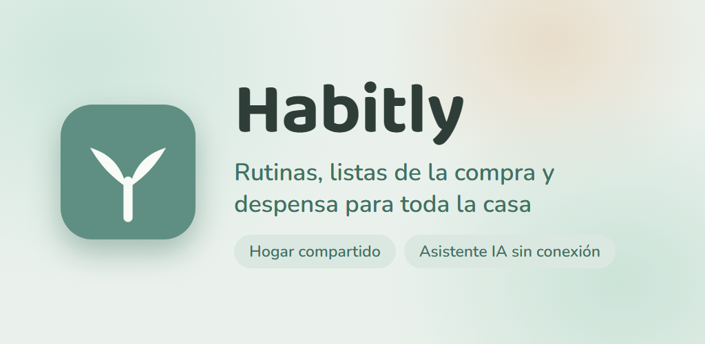
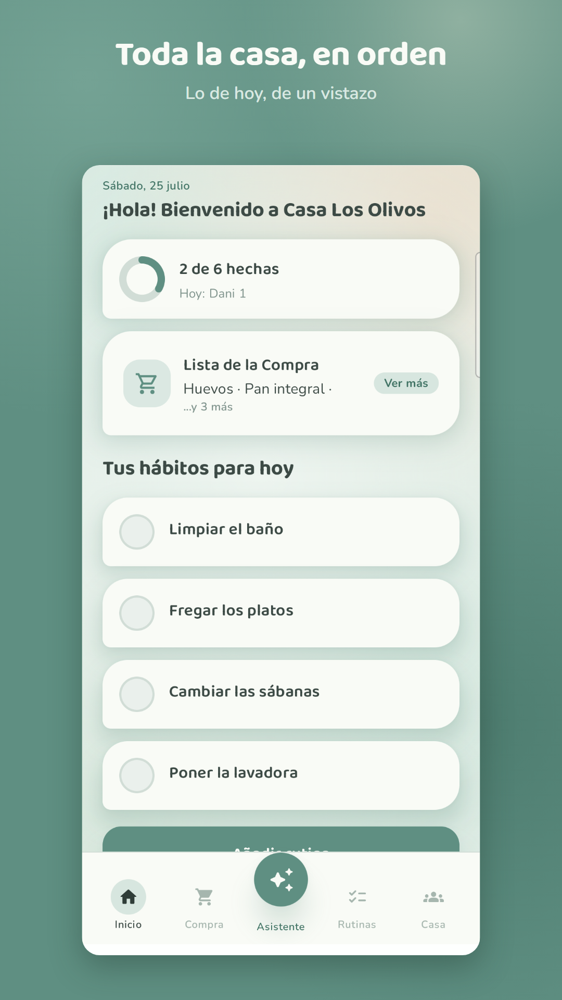
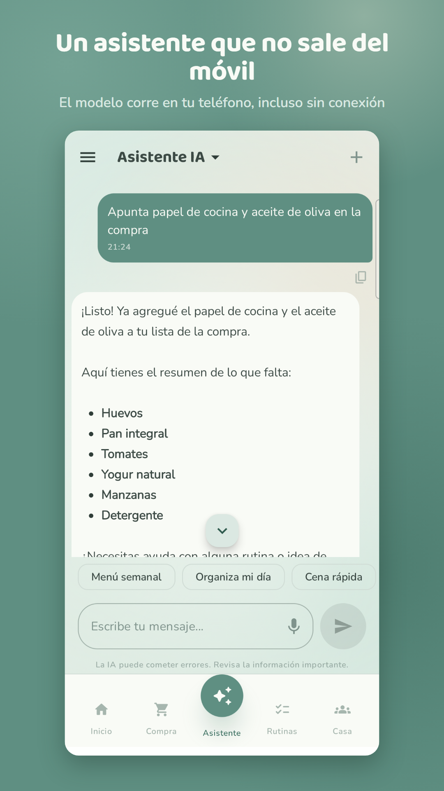
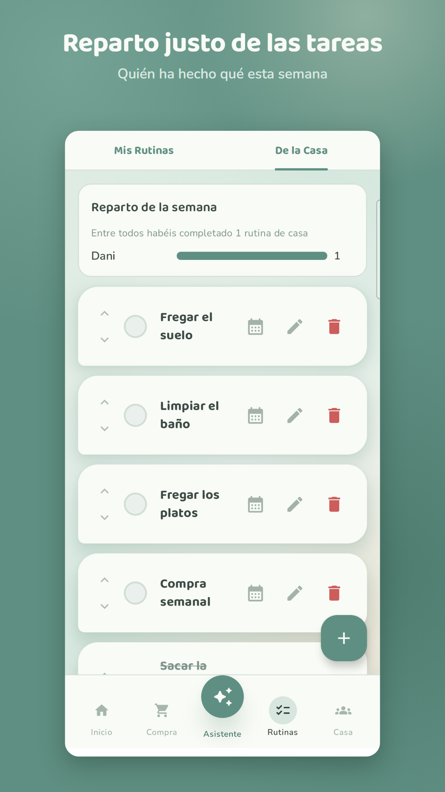

# Habitly

<div align="center">


[](https://github.com/sogekingdabest/Habitly/actions/workflows/ci.yml)

**Smart household management powered by on-device AI**

[English](#english) · [Español](#español) · [Galego](#galego)

</div>

<p align="center">
  
</p>

<p align="center">
  
  
  
</p>

---

Security issues should be reported privately as described in [SECURITY.md](SECURITY.md). Before a
production release, follow the [production security checklist](docs/production-security-checklist.md).
Contributions are welcome through [CONTRIBUTING.md](CONTRIBUTING.md). Brand and listing assets have
separate terms in [ASSETS_LICENSE.md](ASSETS_LICENSE.md). See [CHANGELOG.md](CHANGELOG.md) for shipped
versions and [docs/releasing.md](docs/releasing.md) for the release process.

---

## English

### About

Habitly is a modern Android app designed to simplify household coordination. Manage shopping lists, organize routines, and get AI-powered suggestions — all running locally on your device with Firebase sync for seamless multi-user collaboration.

### Features

- **Authentication** — Email/password login & registration, Google Sign-In, email verification, and password recovery
- **Household Management** — Create or join households with invite codes, multi-user support with member management
- **Shopping & Pantry** — Manage a real-time shopping list, purchase history, custom stores, and pantry items
- **Routines** — Create flexible personal or shared routines, reminders, templates, and fair household rotation
- **Notes** — Searchable personal and household notes with pinning and rich editing
- **AI Assistant** — 100% on-device inference with LiteRT-LM, downloadable models (Gemma 4), generate recipe suggestions and auto-generate shopping lists, persistent chat sessions with Room database
- **Android Integration** — Home-screen widget, launcher shortcuts, notifications, and text sharing into Habitly

### Tech Stack

| Category | Technology |
|---|---|
| **Language** | Kotlin 2.3.20 |
| **UI** | Jetpack Compose + Material 3 |
| **Architecture** | Clean Architecture + MVI |
| **Dependency Injection** | Hilt |
| **Backend** | Firebase Auth + Firestore |
| **Local Database** | Room |
| **AI/ML** | LiteRT-LM (on-device inference) |
| **Async** | Coroutines + Flow |
| **Navigation** | Navigation Compose + Hilt Navigation |
| **Testing** | JUnit + Hilt Testing + Coroutines Test |

### Architecture

The project follows Clean Architecture principles with feature-based modules. Each feature is organized into three layers:

- **`data/`** — Repository implementations, data sources (local & remote)
- **`domain/`** — Models, repository interfaces, use cases
- **`presentation/`** — Compose screens, ViewModels, UI state/events

```
app/src/main/java/com/monsteraltech/habitly/
├── di/                          # Hilt dependency injection modules
├── feature/
│   ├── aiassistant/             # AI chat assistant with on-device models
│   ├── dashboard/               # Home dashboard
│   ├── household/               # Household & member management
│   ├── login/                   # Authentication (email + Google)
│   ├── main/                    # Main screen with bottom navigation
│   ├── notes/                   # Personal and household notes
│   ├── pantry/                  # Pantry inventory
│   ├── register/                # Registration & email verification
│   ├── routines/                # Routine management
│   ├── settings/                # Preferences and legal links
│   ├── share/                   # Import text shared from other apps
│   ├── shopping/                # Shopping list & history
│   └── widget/                  # Home-screen widget
├── navigation/                  # Navigation graphs
└── ui/theme/                    # Compose theming (colors, typography)
```

### Requirements

- **Min SDK:** 29 (Android 10)
- **Target SDK:** 36
- **JDK:** 21

### Setup

1. Clone the repository
2. Create a Firebase project with Auth (Email/Password + Google) and Firestore enabled
3. Download your `google-services.json` and place it in the `app/` directory (see `app/google-services.json.example` for reference)
4. (Optional for Release builds) Copy `keystore.properties.example` to `keystore.properties` and fill in your signing key details
5. Open in Android Studio and run

### License & Trademark

This project is licensed under the **GNU General Public License v3.0** — see [LICENSE](LICENSE) for the full text. You are free to use, study, modify and redistribute the source code, as long as derivative works are released under the same license and with their source code available.

The license covers the **source code only**. The name **Habitly**, the app icon, the logo and the Play Store listing assets (screenshots and feature graphic under `play-store/`) are trademarks and copyrighted material of Daniel Olañeta, and are **not** licensed under the GPL.

If you publish a derivative work, use your own name, icon and branding. Do not present it in a way that suggests it is the official Habitly app or that it is endorsed by its author.

### Author

**Daniel Olañeta**

---

## Español

### Acerca de

Habitly es una aplicación Android moderna diseñada para simplificar la coordinación del hogar. Gestiona listas de la compra, organiza rutinas y obtén sugerencias impulsadas por IA — todo funcionando localmente en tu dispositivo con sincronización Firebase para colaboración entre múltiples usuarios.

### Funcionalidades

- **Autenticación** — Inicio de sesión y registro con email/contraseña, Google Sign-In, verificación de email y recuperación de contraseña
- **Gestión del Hogar** — Crea o únete a hogares con códigos de invitación, soporte multiusuario con gestión de miembros
- **Compra y Despensa** — Gestiona en tiempo real la lista, el historial, tiendas personalizadas y productos de despensa
- **Rutinas** — Crea rutinas personales o compartidas, recordatorios, plantillas y reparto justo de tareas
- **Notas** — Notas personales y del hogar con búsqueda, fijado y edición enriquecida
- **Asistente de IA** — Inferencia 100% local con LiteRT-LM, modelos descargables (Gemma 4), genera sugerencias de recetas y listas de la compra automáticas, sesiones de chat persistentes con base de datos Room
- **Integración con Android** — Widget, atajos del launcher, notificaciones y recepción de texto compartido

### Tecnologías

| Categoría | Tecnología |
|---|---|
| **Lenguaje** | Kotlin 2.3.20 |
| **UI** | Jetpack Compose + Material 3 |
| **Arquitectura** | Clean Architecture + MVI |
| **Inyección de Dependencias** | Hilt |
| **Backend** | Firebase Auth + Firestore |
| **Base de Datos Local** | Room |
| **IA/ML** | LiteRT-LM (inferencia local) |
| **Asincronía** | Coroutines + Flow |
| **Navegación** | Navigation Compose + Hilt Navigation |
| **Testing** | JUnit + Hilt Testing + Coroutines Test |

### Arquitectura

El proyecto sigue los principios de Clean Architecture con módulos basados en funcionalidades. Cada funcionalidad se organiza en tres capas:

- **`data/`** — Implementaciones de repositorios, fuentes de datos (local y remota)
- **`domain/`** — Modelos, interfaces de repositorio, casos de uso
- **`presentation/`** — Pantallas Compose, ViewModels, estado/eventos de UI

```
app/src/main/java/com/monsteraltech/habitly/
├── di/                          # Módulos de inyección de dependencias Hilt
├── feature/
│   ├── aiassistant/             # Asistente de IA con modelos locales
│   ├── dashboard/               # Panel principal
│   ├── household/               # Gestión del hogar y miembros
│   ├── login/                   # Autenticación (email + Google)
│   ├── main/                    # Pantalla principal con navegación inferior
│   ├── notes/                   # Notas personales y del hogar
│   ├── pantry/                  # Inventario de despensa
│   ├── register/                # Registro y verificación de email
│   ├── routines/                # Gestión de rutinas
│   ├── settings/                # Preferencias y enlaces legales
│   ├── share/                   # Importación de texto compartido
│   ├── shopping/                # Lista de la compra e historial
│   └── widget/                  # Widget de pantalla de inicio
├── navigation/                  # Grafos de navegación
└── ui/theme/                    # Theming de Compose (colores, tipografía)
```

### Requisitos

- **Min SDK:** 29 (Android 10)
- **Target SDK:** 36
- **JDK:** 21

### Configuración

1. Clona el repositorio
2. Crea un proyecto Firebase con Auth (Email/Contraseña + Google) y Firestore activados
3. Descarga tu `google-services.json` y colócalo en el directorio `app/` (puedes usar `app/google-services.json.example` como referencia)
4. (Opcional para builds de Release) Copia `keystore.properties.example` a `keystore.properties` y rellena los datos de tu clave de firma
5. Abre en Android Studio y ejecuta

### Licencia y marca

Este proyecto se distribuye bajo la **GNU General Public License v3.0** — consulta [LICENSE](LICENSE) para el texto completo. Puedes usar, estudiar, modificar y redistribuir el código fuente, siempre que las obras derivadas se publiquen bajo la misma licencia y con su código fuente disponible.

La licencia cubre **únicamente el código fuente**. El nombre **Habitly**, el icono de la aplicación, el logotipo y los materiales de la ficha de Play Store (capturas e imagen destacada en `play-store/`) son marca y material protegido de Daniel Olañeta, y **no** se licencian bajo la GPL.

Si publicas una obra derivada, usa tu propio nombre, icono e identidad visual. No la presentes de forma que sugiera que es la aplicación oficial de Habitly o que cuenta con el respaldo de su autor.

### Autor

**Daniel Olañeta**

---

## Galego

### Acerca de

Habitly é unha aplicación Android moderna deseñada para simplificar a coordinación do fogar. Xestiona listas da compra, organiza rutinas e obtén suxestións impulsadas por IA — todo funcionando localmente no teu dispositivo con sincronización Firebase para colaboración entre múltiples usuarios.

### Funcionalidades

- **Autenticación** — Inicio de sesión e rexistro con email/contrasinal, Google Sign-In, verificación de email e recuperación de contrasinal
- **Xestión do Fogar** — Crea ou únete a fogares con códigos de invitación, soporte multiusuario con xestión de membros
- **Compra e Despensa** — Xestiona en tempo real a lista, o historial, tendas personalizadas e produtos da despensa
- **Rutinas** — Crea rutinas persoais ou compartidas, recordatorios, modelos e reparto xusto de tarefas
- **Notas** — Notas persoais e do fogar con busca, fixado e edición enriquecida
- **Asistente de IA** — Inferencia 100% local con LiteRT-LM, modelos descargables (Gemma 4), xera suxestións de receitas e listas da compra automáticas, sesións de chat persistentes con base de datos Room
- **Integración con Android** — Widget, atallos do launcher, notificacións e recepción de texto compartido

### Tecnoloxías

| Categoría | Tecnoloxía |
|---|---|
| **Linguaxe** | Kotlin 2.3.20 |
| **UI** | Jetpack Compose + Material 3 |
| **Arquitectura** | Clean Architecture + MVI |
| **Inxección de Dependencias** | Hilt |
| **Backend** | Firebase Auth + Firestore |
| **Base de Datos Local** | Room |
| **IA/ML** | LiteRT-LM (inferencia local) |
| **Asincronía** | Coroutines + Flow |
| **Navegación** | Navigation Compose + Hilt Navigation |
| **Testing** | JUnit + Hilt Testing + Coroutines Test |

### Arquitectura

O proxecto segue os principios de Clean Architecture con módulos baseados en funcionalidades. Cada funcionalidade organízase en tres capas:

- **`data/`** — Implementacións de repositorios, fontes de datos (local e remota)
- **`domain/`** — Modelos, interfaces de repositorio, casos de uso
- **`presentation/`** — Pantallas Compose, ViewModels, estado/eventos de UI

```
app/src/main/java/com/monsteraltech/habitly/
├── di/                          # Módulos de inxección de dependencias Hilt
├── feature/
│   ├── aiassistant/             # Asistente de IA con modelos locais
│   ├── dashboard/               # Panel principal
│   ├── household/               # Xestión do fogar e membros
│   ├── login/                   # Autenticación (email + Google)
│   ├── main/                    # Pantalla principal con navegación inferior
│   ├── notes/                   # Notas persoais e do fogar
│   ├── pantry/                  # Inventario da despensa
│   ├── register/                # Rexistro e verificación de email
│   ├── routines/                # Xestión de rutinas
│   ├── settings/                # Preferencias e ligazóns legais
│   ├── share/                   # Importación de texto compartido
│   ├── shopping/                # Lista da compra e historial
│   └── widget/                  # Widget da pantalla de inicio
├── navigation/                  # Grafos de navegación
└── ui/theme/                    # Theming de Compose (cores, tipografía)
```

### Requisitos

- **Min SDK:** 29 (Android 10)
- **Target SDK:** 36
- **JDK:** 21

### Configuración

1. Clona o repositorio
2. Crea un proxecto Firebase con Auth (Email/Contrasinal + Google) e Firestore activados
3. Descarga o teu `google-services.json` e colócao no directorio `app/` (podes usar `app/google-services.json.example` como referencia)
4. (Opcional para builds de Release) Copia `keystore.properties.example` a `keystore.properties` e enche os datos da túa chave de sinatura
5. Abre en Android Studio e executa

### Licenza e marca

Este proxecto distribúese baixo a **GNU General Public License v3.0** — consulta [LICENSE](LICENSE) para o texto completo. Podes usar, estudar, modificar e redistribuír o código fonte, sempre que as obras derivadas se publiquen baixo a mesma licenza e co seu código fonte dispoñible.

A licenza cobre **unicamente o código fonte**. O nome **Habitly**, a icona da aplicación, o logotipo e os materiais da ficha de Play Store (capturas e imaxe destacada en `play-store/`) son marca e material protexido de Daniel Olañeta, e **non** se licencian baixo a GPL.

Se publicas unha obra derivada, usa o teu propio nome, icona e identidade visual. Non a presentes de forma que suxira que é a aplicación oficial de Habitly ou que conta co respaldo do seu autor.

### Autor

**Daniel Olañeta**
